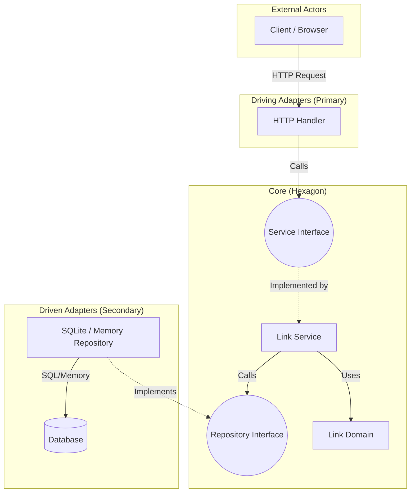
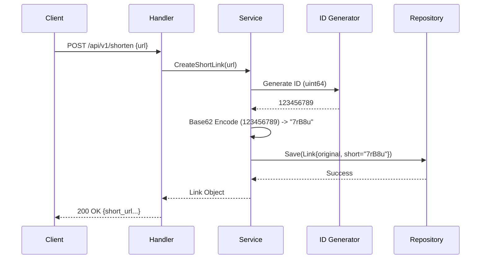
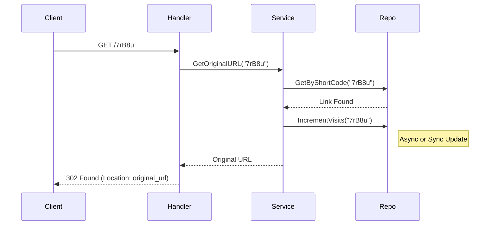

# Design Specification: Calanggo URL Shortener
*Based on ByteByteGo System Design*

## 1. Visão Geral
O **Calanggo** é um encurtador de URLs de alta performance desenvolvido em Go, seguindo os princípios da Arquitetura Hexagonal (Ports & Adapters).

## 2. Arquitetura
O sistema é estruturado para desacoplar a lógica de negócio (Core) das dependências externas (Adapters), como banco de dados e interfaces HTTP.



## 3. Requisitos
### Funcionais
1.  **Shortening:** Dado uma URL longa, retornar uma URL curta única (ex: `http://calang.go/7rB8u`).
2.  **Redirection:** Dado uma URL curta, redirecionar (HTTP 301 ou 302) para a original.
3.  **Stats:** Contabilizar acessos (visitas) a cada redirecionamento.

### Não-Funcionais
-   **Baixa Latência:** O redirecionamento deve ser extremamente rápido.
-   **Disponibilidade:** O sistema deve priorizar leitura.
-   **Escalabilidade:** Design preparado para migração de IDs distribuídos.

## 4. API Design (REST)

### A. Criar Short URL
**POST** `/api/v1/shorten`
-   **Request:** `{ "long_url": "https://www.google.com" }`
-   **Response:**
    ```json
    {
        "id": "7rB8u",
        "original": "https://www.google.com",
        "shortened": "7rB8u",
        "created_at": "2026-01-10T10:00:00Z",
        "visits": 0
    }
    ```

### B. Redirecionar
**GET** `/{code}`
-   **Response:** HTTP 302 (Found) -> `Location: {original_url}`
-   *Nota:* Utilizamos 302 para garantir que a requisição passe pelo servidor para contabilização de visitas.

## 5. Fluxos de Execução

### Shorten URL Flow


### Redirect Flow


## 6. Core Logic: Base62 Conversion
Utilizamos conversão de base para gerar strings curtas a partir de IDs numéricos.

-   **Algabeto:** `[a-z, A-Z, 0-9]` (62 caracteres).
-   **Capacidade:** Com 7 caracteres, temos $62^7 \approx 3.5$ trilhões de combinações.
-   **Estratégia Atual:**
    -   Geramos um ID aleatório (`uint64`).
    -   Convertemos para Base62.
    -   *Futuro:* Usar Snowflake ID ou auto-incremento de banco para garantir ordem e não-colisão global.

## 7. Data Model
Estrutura persistida (Ex: SQLite):
-   `id`: TEXT/VARCHAR (Primary Key - Short Code)
-   `original_url`: TEXT
-   `created_at`: DATETIME
-   `visits`: INTEGER

## 8. Estrutura do Projeto
```text
/
├── cmd/                # (Opcional) Main applications
├── docs/               # Documentação
├── internal/
│   ├── adapters/
│   │   ├── http/       # Handlers HTTP (Driving Adapter)
│   │   └── repository/ # Implementação DB (Driven Adapter)
│   └── core/
│       ├── domain/     # Entidades (Link)
│       ├── ports/      # Interfaces (Repository, Service)
│       └── services/   # Regras de Negócio
├── pkg/
│   └── base62/         # Lógica auxiliar (independente de domínio)
├── tests/              # Testes de integração
└── main.go             # Entry point (Wiring)
```